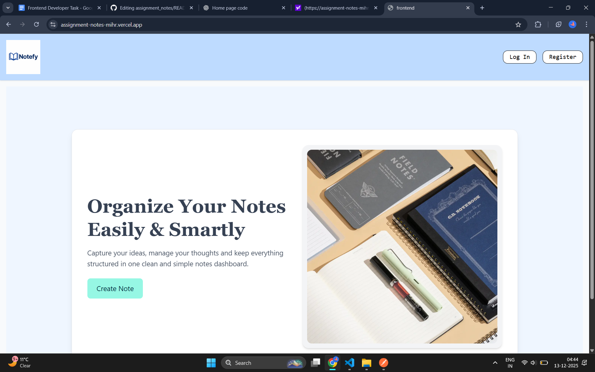
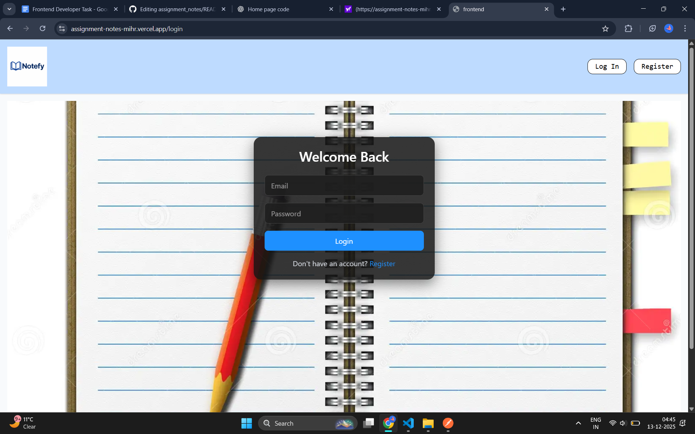
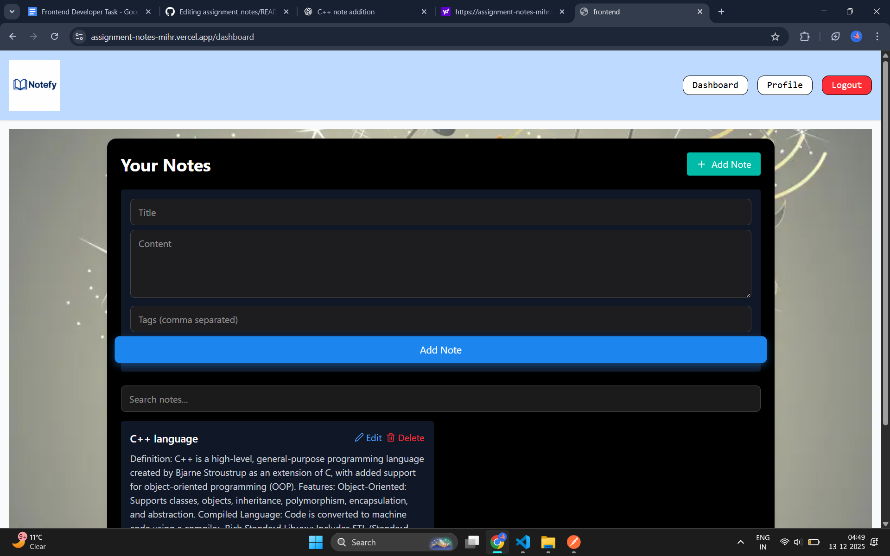
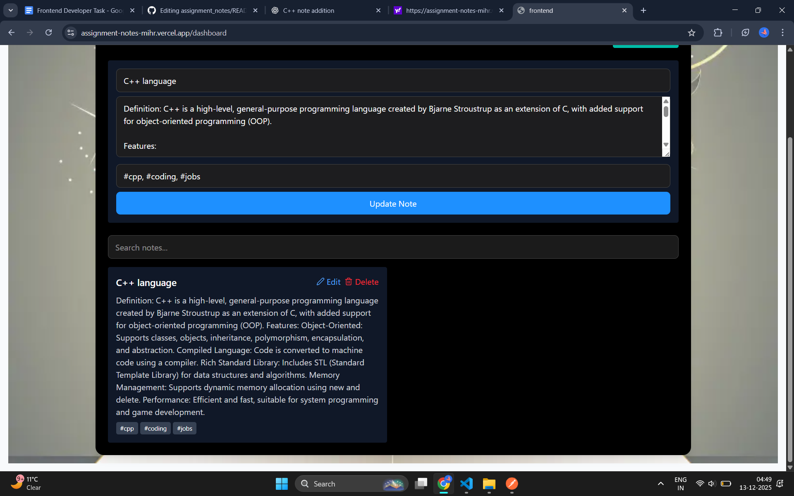

# 📝 Organize Your Notes - Easily & Smartly

> **Capture your ideas, manage your thoughts and keep everything structured in one clean and simple notes dashboard.**

A modern, secure, and scalable web application built as part of the **Frontend Developer Intern Assignment**. This project demonstrates full-stack development skills with authentication, CRUD operations, and a responsive UI.

---

## 🚀 Live Demo
- **Frontend**: [Deployed Link](#) _(https://assignment-notes-mihr.vercel.app/)_
- **Backend**: [Deployed Link](#) _(https://assignment-notes-3.onrender.com)_
- **Backend API**: [API Docs](#) _(Add your API documentation link)_

---

## ✨ Features

### 🎨 Frontend (Primary Focus)
- ✅ **Modern UI/UX** - Built with React.js
- ✅ **Responsive Design** - TailwindCSS/
- ✅ **Form Validation** - Client-side and server-side validation
- ✅ **Protected Routes** - Authentication required for dashboard access
- ✅ **Search & Filter** - Find notes quickly and efficiently

### 🔐 Authentication & Security
- ✅ **JWT-based Authentication** - Secure login/signup/logout
- ✅ **Password Hashing** - Using bcrypt for secure password storage
- ✅ **Token Validation** - Protected API routes with middleware
- ✅ **Error Handling** - Comprehensive validation and error messages

### 📊 Dashboard Features
- ✅ **User Profile Management** - View and update profile information
- ✅ **CRUD Operations on Notes**
  - Create new notes
  - Read/View all notes
  - Update existing notes
  - Delete notes
- ✅ **Search Functionality** - Filter notes by title or content
- ✅ **Logout Flow** - Secure session management

### 🛠️ Backend (Supportive)
- ✅ **Lightweight Backend** - Node.js/Express
- ✅ **RESTful APIs** - Clean and organized API structure
- ✅ **Database Integration** - MongoDB
- ✅ **Scalable Architecture** - Modular and maintainable code structure

---

## 🛠️ Tech Stack

| Category | Technology |
|----------|-----------|
| **Frontend** | React.js |
| **Styling** | TailwindCSS |
| **Backend** | Node.js + Express  |
| **Database** | MongoDB L |
| **Authentication** | JWT (JSON Web Tokens) |
| **Password Security** | bcryptjs |
| **API Testing** | Postman |

---

## 📁 Project Structure

```
assignment_notes/
├── backend/
│   ├── controllers/       # Business logic
│   ├── models/           # Database schemas
│   ├── routes/           # API endpoints
│   ├── middleware/       # Auth & validation        
│   └── server.js         # Entry point
├── frontend/
│   ├── src/
│   │   ├── components/   # Reusable UI components
│   │   ├── pages/        # Route pages
│   │   ├── services/     # API client
│   │   ├── context/      # State management
│   │   └── App.js        # Main app component
│   └── public/           # Static assets
└── README.md             # You are here! 
```

---

## 🚀 Quick Start

### Prerequisites
- Node.js (v16+)
- npm or yarn
- MongoDB/PostgreSQL/MySQL installed

### 1️⃣ Clone the Repository
```bash
git clone https://github.com/PriyaTripathi15/assignment_notes. git
cd assignment_notes
```

### 2️⃣ Backend Setup
```bash
cd backend
npm install
```

Create a `.env` file in the `backend/` directory:
```env
PORT=5000
MONGO_URI=your_mongodb_connection_string
JWT_SECRET=your_secure_random_secret_key
NODE_ENV=development
```

Start the backend server:
```bash
npm run dev
```
Backend will run at `http://localhost:5000`

### 3️⃣ Frontend Setup
```bash
cd frontend
npm install
```

Create a `.env` file in the `frontend/` directory:
```env
REACT_APP_API_URL=http://localhost:5000/api
```

Start the frontend development server:
```bash
npm run dev
```
Frontend will run at `http://localhost:5173` or `http://localhost:3000`

---

## 📡 API Endpoints

### Authentication
| Method | Endpoint | Description | Auth Required |
|--------|----------|-------------|---------------|
| POST | `/api/auth/register` | Register new user | ❌ |
| POST | `/api/auth/login` | Login user | ❌ |
| GET | `/api/auth/profile` | Get user profile | ✅ |
| PUT | `/api/auth/profile` | Update user profile | ✅ |

### Notes (CRUD)
| Method | Endpoint | Description | Auth Required |
|--------|----------|-------------|---------------|
| GET | `/api/notes` | Get all notes | ✅ |
| POST | `/api/notes` | Create new note | ✅ |
| GET | `/api/notes/:id` | Get single note | ✅ |
| PUT | `/api/notes/:id` | Update note | ✅ |
| DELETE | `/api/notes/:id` | Delete note | ✅ |

📦 **Postman Collection**:  Import `postman_collection.json` for API testing

---

## 🔐 Security Implementation

- ✅ **Password Hashing**:  All passwords are hashed using bcrypt before storage
- ✅ **JWT Authentication**: Secure token-based authentication
- ✅ **Protected Routes**: Middleware validation on sensitive endpoints
- ✅ **Input Validation**: Client-side and server-side validation
- ✅ **Environment Variables**: Secrets managed via `.env` (not committed)
- ✅ **Error Handling**: Comprehensive error responses

---

## 📈 Scalability & Production Readiness

### Current Implementation
- Modular code structure for easy maintenance
- RESTful API design principles
- Separation of concerns (MVC pattern)
- Environment-based configuration

### Future Enhancements for Production
1. **Frontend Optimization**
   - Code splitting and lazy loading
   - CDN for static assets
   - Server-side rendering (SSR) with Next.js
   - Progressive Web App (PWA) capabilities

2. **Backend Scalability**
   - API versioning (`/api/v1/`, `/api/v2/`)
   - Rate limiting and throttling
   - Caching layer (Redis)
   - Database indexing and query optimization
   - Horizontal scaling with load balancers

3. **DevOps & Monitoring**
   - CI/CD pipeline (GitHub Actions, Jenkins)
   - Automated testing (Jest, Cypress)
   - Logging and monitoring (Winston, ELK stack)
   - Containerization (Docker)
   - Cloud deployment (AWS, Vercel, Railway)

4. **Security Enhancements**
   - HTTPS/SSL certificates
   - CORS configuration
   - Helmet. js for security headers
   - Input sanitization against XSS/SQL injection
   - Regular dependency updates

---

## 📦 Deliverables

✅ Fully functional frontend (React) and backend (Node.js)  
✅ Working authentication system (register/login/logout with JWT)  
✅ Dashboard with CRUD operations on notes  
✅ Postman collection for API testing  
✅ Documentation on scaling considerations  
✅ Responsive design across devices  
✅ Clean, modular, and documented code  

---

## 📸 Screenshots
### Home Page



### Login Page


### Dashboard


### Profile Page


### Notes Management


## 👨‍💻 Developer

**Priya Tripathi**  
- GitHub: [@PriyaTripathi15](https://github.com/PriyaTripathi15)
- Email: [Your Email]
- Portfolio: [Your Portfolio Link]

---

## 📄 License

This project is created as part of an internship assignment and is for educational purposes. 

---

## 🙏 Acknowledgments

- Assignment provided by Bajarangs & PrimeTrade. ai
- Built with modern web development best practices
- Inspired by clean and scalable architecture patterns

---

## 📞 Contact & Support

For any queries regarding this project: 
- Open an issue on [GitHub](https://github.com/PriyaTripathi15/assignment_notes/issues)
- Email: [Your Email]

---

**⭐ If you like this project, please give it a star on GitHub! **

---

*"Organize Your Notes - Easily & Smartly"*  
*Built with ❤️ by Priya Tripathi*
```
